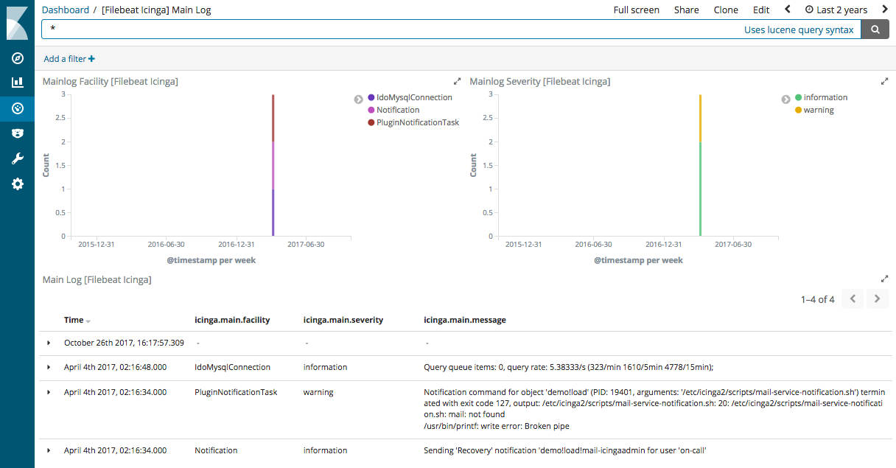

---
mapped_pages:
  - https://www.elastic.co/guide/en/beats/filebeat/current/filebeat-module-icinga.html
---

<!-- This file is generated! See scripts/docs_collector.py -->

# Icinga module [filebeat-module-icinga]

The `icinga` module parses the main, debug, and startup logs of [Icinga](https://www.icinga.com/products/icinga-2/).

When you run the module, it performs a few tasks under the hood:

* Sets the default paths to the log files (but don’t worry, you can override the defaults)
* Makes sure each multiline log event gets sent as a single event
* Uses an {{es}} ingest pipeline to parse and process the log lines, shaping the data into a structure suitable for visualizing in Kibana
* Deploys dashboards for visualizing the log data

::::{tip}
Read the [quick start](/reference/filebeat/filebeat-installation-configuration.md) to learn how to configure and run modules.
::::


## Compatibility [_compatibility_16]

The `icinga` module was tested with Icinga >= 2.x on various Linux and Windows systems.

This module is not available for macOS.


## Configure the module [configuring-icinga-module]

You can further refine the behavior of the `icinga` module by specifying [variable settings](#icinga-settings) in the `modules.d/icinga.yml` file, or overriding settings at the command line.

You must enable at least one fileset in the module. **Filesets are disabled by default.**

The following example shows how to set paths in the `modules.d/icinga.yml` file to override the default paths for logs:

```yaml
- module: icinga
  main:
    enabled: true
    var.paths: ["/path/to/log/icinga2/icinga2.log*"]
  debug:
    enabled: true
    var.paths: ["/path/to/log/icinga2/debug.log*"]
  startup:
    enabled: true
    var.paths: ["/path/to/log/icinga2/startup.log"]
```

To specify the same settings at the command line, you use:

```sh
-M "icinga.main.var.paths=[/path/to/log/icinga2/icinga2.log*]" -M "icinga.debug.var.paths=[/path/to/log/icinga2/debug.log*]" -M "icinga.startup.var.paths=[/path/to/log/icinga2/startup.log]"
```


### Variable settings [icinga-settings]

Each fileset has separate variable settings for configuring the behavior of the module. If you don’t specify variable settings, the `icinga` module uses the defaults.

For advanced use cases, you can also override input settings. See [Override input settings](/reference/filebeat/advanced-settings.md).

::::{tip}
When you specify a setting at the command line, remember to prefix the setting with the module name, for example, `icinga.main.var.paths` instead of `main.var.paths`.
::::


### `main` log fileset settings [_main_log_fileset_settings]

**`var.paths`**
:   An array of glob-based paths that specify where to look for the log files. All patterns supported by [Go Glob](https://golang.org/pkg/path/filepath/#Glob) are also supported here. For example, you can use wildcards to fetch all files from a predefined level of subdirectories: `/path/to/log/*/*.log`. This fetches all `.log` files from the subfolders of `/path/to/log`. It does not fetch log files from the `/path/to/log` folder itself. If this setting is left empty, Filebeat will choose log paths based on your operating system.


### `debug` log fileset settings [_debug_log_fileset_settings]

**`var.paths`**
:   An array of glob-based paths that specify where to look for the log files. All patterns supported by [Go Glob](https://golang.org/pkg/path/filepath/#Glob) are also supported here. For example, you can use wildcards to fetch all files from a predefined level of subdirectories: `/path/to/log/*/*.log`. This fetches all `.log` files from the subfolders of `/path/to/log`. It does not fetch log files from the `/path/to/log` folder itself. If this setting is left empty, Filebeat will choose log paths based on your operating system.


### `startup` log fileset settings [_startup_log_fileset_settings]

**`var.paths`**
:   An array of glob-based paths that specify where to look for the log files. All patterns supported by [Go Glob](https://golang.org/pkg/path/filepath/#Glob) are also supported here. For example, you can use wildcards to fetch all files from a predefined level of subdirectories: `/path/to/log/*/*.log`. This fetches all `.log` files from the subfolders of `/path/to/log`. It does not fetch log files from the `/path/to/log` folder itself. If this setting is left empty, Filebeat will choose log paths based on your operating system.


## Example dashboard [_example_dashboard_9]

This module comes with sample dashboards. For example:

% TO DO: Use `:class: screenshot`


## Fields [_fields]

For a description of each field in the module, see the [exported fields](/reference/filebeat/exported-fields-icinga.md) section.
