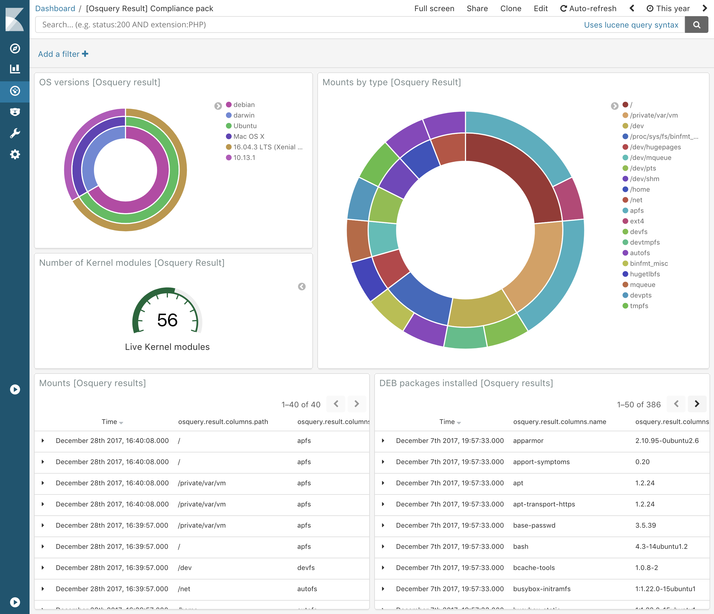

---
mapped_pages:
  - https://www.elastic.co/guide/en/beats/filebeat/current/filebeat-module-osquery.html
---

<!-- This file is generated! See scripts/docs_collector.py -->

# Osquery module [filebeat-module-osquery]

:::::{admonition} Prefer to use {{agent}} for this use case?
Refer to the [Elastic Integrations documentation](integration-docs://reference/osquery/index.md).

::::{dropdown} Learn more
{{agent}} is a single, unified way to add monitoring for logs, metrics, and other types of data to a host. It can also protect hosts from security threats, query data from operating systems, forward data from remote services or hardware, and more. Refer to the documentation for a detailed [comparison of {{beats}} and {{agent}}](docs-content://reference/fleet/index.md).

::::


:::::


The `osquery` module collects and decodes the result logs written by [osqueryd](https://osquery.readthedocs.io/en/latest/introduction/using-osqueryd/) in the JSON format. To set up osqueryd follow the osquery installation instructions for your operating system and configure the `filesystem` logging driver (the default). Make sure UTC timestamps are enabled.

When you run the module, it performs a few tasks under the hood:

* Sets the default paths to the log files (but don’t worry, you can override the defaults)
* Makes sure each multiline log event gets sent as a single event
* Uses an {{es}} ingest pipeline to parse and process the log lines, shaping the data into a structure suitable for visualizing in Kibana
* Deploys dashboards for visualizing the log data

::::{tip}
Read the [quick start](/reference/filebeat/filebeat-installation-configuration.md) to learn how to configure and run modules.
::::


## Compatibility [_compatibility_28]

The  `osquery` module was tested with logs from osquery version 2.10.2. Since the results are written in the JSON format, it is likely that this module works with any version of osquery.

This module is available on Linux, macOS, and Windows.


## Configure the module [configuring-osquery-module]

You can further refine the behavior of the `osquery` module by specifying [variable settings](#osquery-settings) in the `modules.d/osquery.yml` file, or overriding settings at the command line.

You must enable at least one fileset in the module. **Filesets are disabled by default.**

The following example shows how to set paths in the `modules.d/osquery.yml` file to override the default paths for the syslog and authorization logs:

```yaml
- module: osquery
  result:
    enabled: true
    var.paths: ["/path/to/osqueryd.results.log*"]
```

To specify the same settings at the command line, you use:

```sh
-M "osquery.result.var.paths=[/path/to/osqueryd.results.log*]"
```


### Variable settings [osquery-settings]

Each fileset has separate variable settings for configuring the behavior of the module. If you don’t specify variable settings, the `osquery` module uses the defaults.

For advanced use cases, you can also override input settings. See [Override input settings](/reference/filebeat/advanced-settings.md).

::::{tip}
When you specify a setting at the command line, remember to prefix the setting with the module name, for example, `osquery.result.var.paths` instead of `result.var.paths`.
::::


### `result` fileset settings [_result_fileset_settings]

**`var.paths`**
:   An array of glob-based paths that specify where to look for the log files. All patterns supported by [Go Glob](https://golang.org/pkg/path/filepath/#Glob) are also supported here. For example, you can use wildcards to fetch all files from a predefined level of subdirectories: `/path/to/log/*/*.log`. This fetches all `.log` files from the subfolders of `/path/to/log`. It does not fetch log files from the `/path/to/log` folder itself. If this setting is left empty, Filebeat will choose log paths based on your operating system.

**`var.use_namespace`**
:   If true, all fields exported by this module are prefixed with `osquery.result`. Set to false to copy the fields in the root of the document. If enabled, this setting also disables the renaming of some fields (e.g. `hostIdentifier` to `host_identifier`).  Note that if you set this to false, the sample dashboards coming with this module won’t work correctly. The default is true.


## Example dashboard [_example_dashboard_19]

This module comes with a sample dashboard for visualizing the data collected by the "compliance" pack. To collect this data, enable the `it-compliance` pack in the osquery configuration file.

% TO DO: Use `:class: screenshot`


## Fields [_fields]

For a description of each field in the module, see the [exported fields](/reference/filebeat/exported-fields-osquery.md) section.
