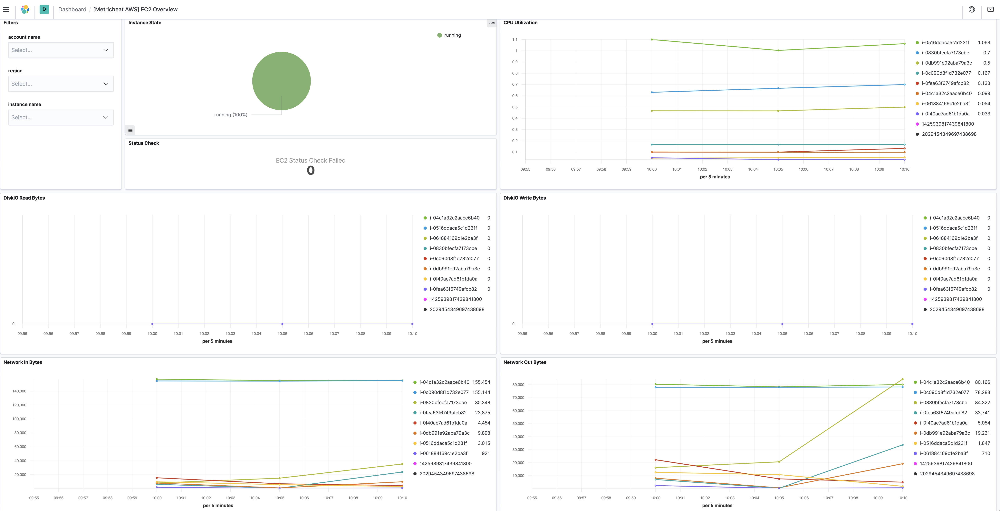

---
mapped_pages:
  - https://www.elastic.co/guide/en/beats/metricbeat/current/metricbeat-metricset-aws-ec2.html
---

<!-- This file is generated! See scripts/mage/docs_collector.go -->

# AWS ec2 metricset [metricbeat-metricset-aws-ec2]

The ec2 metricset of aws module allows you to monitor your AWS EC2 instances, including `cpu`, `network`, `disk` and `status`. `ec2` metricset fetches a set of values from [Cloudwatch AWS EC2 Metrics](https://docs.aws.amazon.com/AWSEC2/latest/UserGuide/viewing_metrics_with_cloudwatch.html#ec2-cloudwatch-metrics).

We fetch the following data:

* **cpu.total.pct**: The percentage of allocated EC2 compute units that are currently in use on the instance.
* **cpu.credit_usage**: The number of CPU credits spent by the instance for CPU utilization.
* **cpu.credit_balance**: The number of earned CPU credits that an instance has accrued since it was launched or started.
* **cpu.surplus_credit_balance**: The number of surplus credits that have been spent by an unlimited instance when its CPUCreditBalance value is zero.
* **cpu.surplus_credits_charged**: The number of spent surplus credits that are not paid down by earned CPU credits, and which thus incur an additional charge.
* **network.in.packets**: The number of packets received on all network interfaces by the instance.
* **network.out.packets**: The number of packets sent out on all network interfaces by the instance.
* **network.in.bytes**: The number of bytes received on all network interfaces by the instance.
* **network.out.bytes**: The number of bytes sent out on all network interfaces by the instance.
* **diskio.read.bytes**: Bytes read from all instance store volumes available to the instance.
* **diskio.write.bytes**: Bytes written to all instance store volumes available to the instance.
* **diskio.read.ops**: Completed read operations from all instance store volumes available to the instance in a specified period of time.
* **diskio.write.ops**: Completed write operations to all instance store volumes available to the instance in a specified period of time.
* **status.check_failed**: Reports whether the instance has passed both the instance status check and the system status check in the last minute.
* **status.check_failed_system**: Reports whether the instance has passed the system status check in the last minute.
* **status.check_failed_instance**: Reports whether the instance has passed the instance status check in the last minute.
* **instance.core.count**: The number of CPU cores for the instance.
* **instance.image.id**: The ID of the image used to launch the instance.
* **instance.monitoring.state**: Indicates whether detailed monitoring is enabled.
* **instance.private.dns_name**: The private DNS name of the network interface.
* **instance.private.ip**: The private IPv4 address associated with the network interface.
* **instance.public.dns_name**: The public DNS name of the instance.
* **instance.public.ip**: The address of the Elastic IP address (IPv4) bound to the network interface.
* **instance.state.code**: The state of the instance, as a 16-bit unsigned integer.
* **instance.threads_per_core**: The state of the instance (pending | running | shutting-down | terminated | stopping | stopped).


## AWS Permissions [_aws_permissions_5]

Some specific AWS permissions are required for IAM user to collect AWS EC2 metrics.

```
ec2:DescribeInstances
ec2:DescribeRegions
cloudwatch:GetMetricData
cloudwatch:ListMetrics
sts:GetCallerIdentity
iam:ListAccountAliases
```


## Dashboard [_dashboard_6]

The aws ec2 metricset comes with a predefined dashboard. For example:




## Configuration example [_configuration_example_5]

```yaml
- module: aws
  period: 300s
  metricsets:
    - ec2
  access_key_id: '<access_key_id>'
  secret_access_key: '<secret_access_key>'
  session_token: '<session_token>'
  tags_filter:
    - key: "Organization"
      value: ["Engineering", "Product"]
```

`tags_filter` can be specified to only collect metrics with certain tag keys/values. For example, with the configuration example above, ec2 metricset will only collect metrics from EC2 instances that have tag key equals "Organization" and tag value equals to "Engineering" or "Product".

This is a default metricset. If the host module is unconfigured, this metricset is enabled by default.

## Fields [_fields]

For a description of each field in the metricset, see the [exported fields](/reference/metricbeat/exported-fields-aws.md) section.

Here is an example document generated by this metricset:

```json
{
    "@timestamp": "2017-10-12T08:05:34.853Z",
    "aws": {
        "cloudwatch": {
            "namespace": "AWS/EC2"
        },
        "dimensions": {
            "InstanceId": "i-05b6228ff8d8c5d49"
        },
        "ec2": {
            "cpu": {
                "credit_balance": 144,
                "credit_usage": 0.007318,
                "surplus_credit_balance": 0,
                "surplus_credits_charged": 0
            },
            "diskio": {
                "read": {
                    "bytes_per_sec": 0,
                    "count_per_sec": 0
                },
                "write": {
                    "bytes_per_sec": 0,
                    "count_per_sec": 0
                }
            },
            "instance": {
                "core": {
                    "count": 1
                },
                "image": {
                    "id": "ami-058b1b7fe545997ae"
                },
                "monitoring": {
                    "state": "disabled"
                },
                "private": {
                    "dns_name": "ip-172-31-31-247.eu-west-1.compute.internal",
                    "ip": "172.31.31.247"
                },
                "public": {
                    "dns_name": "ec2-54-194-39-129.eu-west-1.compute.amazonaws.com",
                    "ip": "54.194.39.129"
                },
                "state": {
                    "code": 16,
                    "name": "running"
                },
                "threads_per_core": 1
            },
            "network": {
                "in": {
                    "bytes_per_sec": 18.343333333333334,
                    "packets_per_sec": 0.15666666666666668
                },
                "out": {
                    "bytes_per_sec": 15.326666666666666,
                    "packets_per_sec": 0.16
                }
            },
            "status": {
                "check_failed": 0,
                "check_failed_instance": 0,
                "check_failed_system": 0
            }
        }
    },
    "cloud": {
        "account": {
            "id": "428152502467",
            "name": "elastic-beats"
        },
        "availability_zone": "eu-west-1a",
        "instance": {
            "id": "i-05b6228ff8d8c5d49"
        },
        "machine": {
            "type": "t2.micro"
        },
        "provider": "aws",
        "region": "eu-west-1"
    },
    "event": {
        "dataset": "aws.ec2",
        "duration": 115000,
        "module": "aws"
    },
    "host": {
        "cpu": {
            "usage": 0.1005649717511616
        },
        "disk": {
            "read": {
                "bytes": 0
            },
            "write": {
                "bytes": 0
            }
        },
        "id": "i-05b6228ff8d8c5d49",
        "name": "i-05b6228ff8d8c5d49",
        "network": {
            "egress": {
                "bytes": 4598,
                "packets": 48
            },
            "ingress": {
                "bytes": 5503,
                "packets": 47
            }
        }
    },
    "metricset": {
        "name": "ec2",
        "period": 10000
    },
    "service": {
        "type": "aws"
    }
}
```
