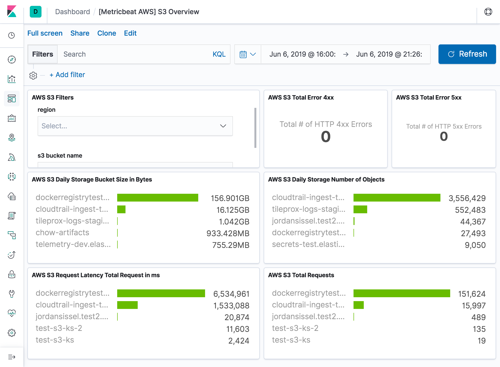

---
mapped_pages:
  - https://www.elastic.co/guide/en/beats/metricbeat/current/metricbeat-metricset-aws-s3_request.html
---

<!-- This file is generated! See scripts/mage/docs_collector.go -->

# AWS s3_request metricset [metricbeat-metricset-aws-s3_request]

The s3_request metricset of aws module allows you to monitor your AWS S3 buckets. `s3_request` metricset fetches Cloudwatch daily storage metrics for each S3 bucket from [S3 CloudWatch Request Metrics for Buckets](https://docs.aws.amazon.com/AmazonS3/latest/dev/cloudwatch-monitoring.html).

Note: Request metrics are not enabled by default. You must opt into request metrics by configuring them in the console or using the Amazon S3 API. Please see [How to Configure Request Metrics for S3](https://docs.aws.amazon.com/AmazonS3/latest/user-guide/configure-metrics.html) for instructions on how to enable request metrics for each S3 bucket.


## AWS Permissions [_aws_permissions_12]

Some specific AWS permissions are required for IAM user to collect AWS s3_request metrics.

```
ec2:DescribeRegions
cloudwatch:GetMetricData
cloudwatch:ListMetrics
sts:GetCallerIdentity
iam:ListAccountAliases
```


## Dashboard [_dashboard_13]

The aws s3_request metricset and s3_daily_storage metricset shares one predefined dashboard. For example:



Note: If s3 request metrics are not enabled for the specific S3 bucket, some visualizations in this dashboard will be empty.


## Configuration example [_configuration_example_12]

```yaml
- module: aws
  period: 86400s
  metricsets:
    - s3_request
  access_key_id: '<access_key_id>'
  secret_access_key: '<secret_access_key>'
  session_token: '<session_token>'
```

This is a default metricset. If the host module is unconfigured, this metricset is enabled by default.

## Fields [_fields]

For a description of each field in the metricset, see the [exported fields](/reference/metricbeat/exported-fields-aws.md) section.

Here is an example document generated by this metricset:

```json
{
    "@timestamp": "2017-10-12T08:05:34.853Z",
    "aws": {
        "cloudwatch": {
            "namespace": "AWS/S3"
        },
        "dimensions": {
            "FilterId": "request-metrics"
        },
        "s3": {
            "bucket": {
                "name": "test-ks-1"
            }
        },
        "s3_request": {
            "errors": {
                "4xx": 0,
                "5xx": 0
            },
            "latency": {
                "first_byte": {
                    "ms": 47.25
                },
                "total_request": {
                    "ms": 57.75
                }
            },
            "requests": {
                "put": 1,
                "total": 1
            },
            "uploaded": {
                "bytes": 463
            }
        }
    },
    "cloud": {
        "account": {
            "id": "428152502467",
            "name": "elastic-beats"
        },
        "provider": "aws",
        "region": "us-east-1"
    },
    "event": {
        "dataset": "aws.s3_request",
        "duration": 115000,
        "module": "aws"
    },
    "metricset": {
        "name": "s3_request",
        "period": 10000
    },
    "service": {
        "type": "aws"
    }
}
```
