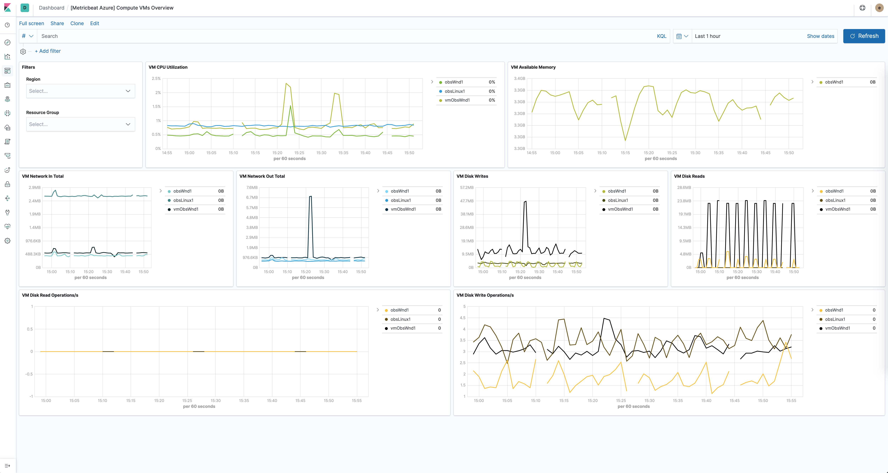
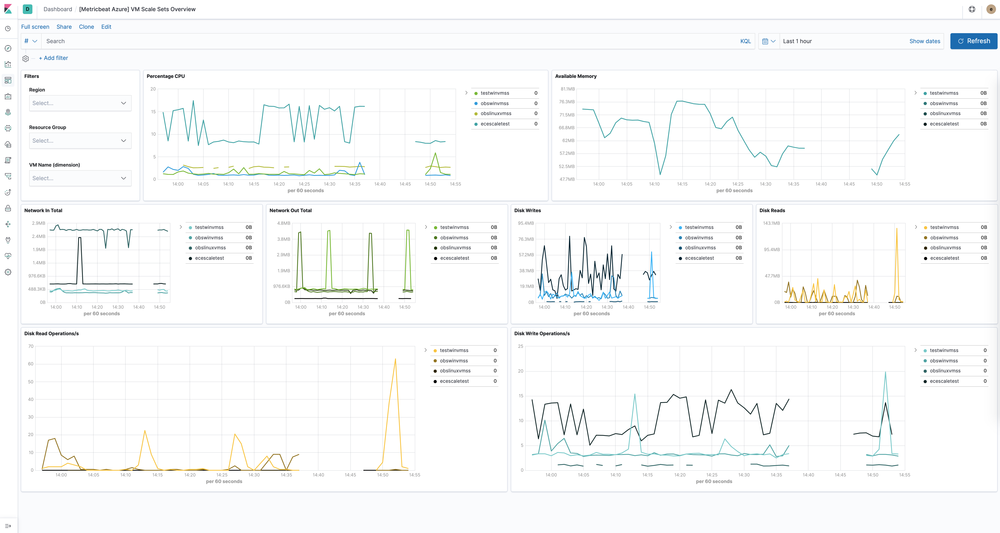
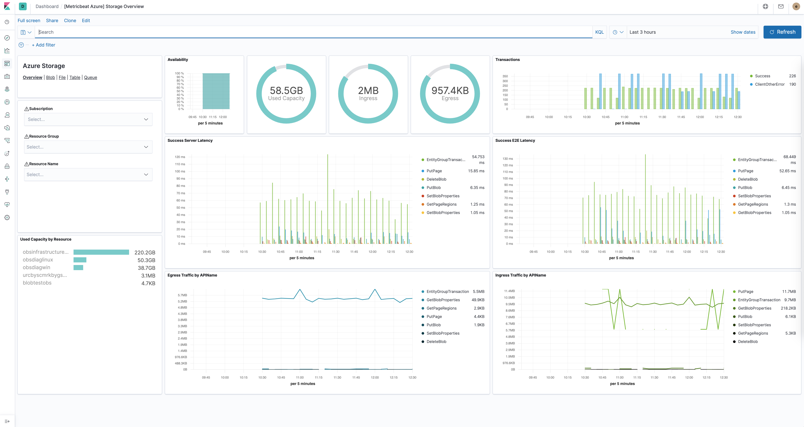
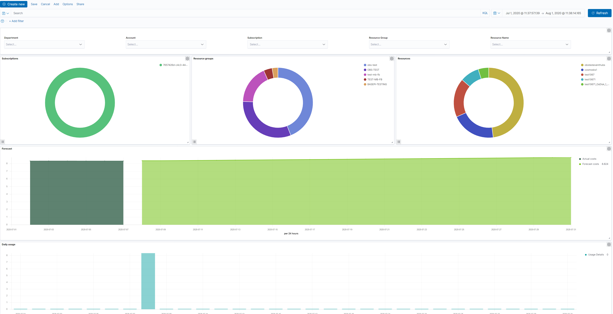
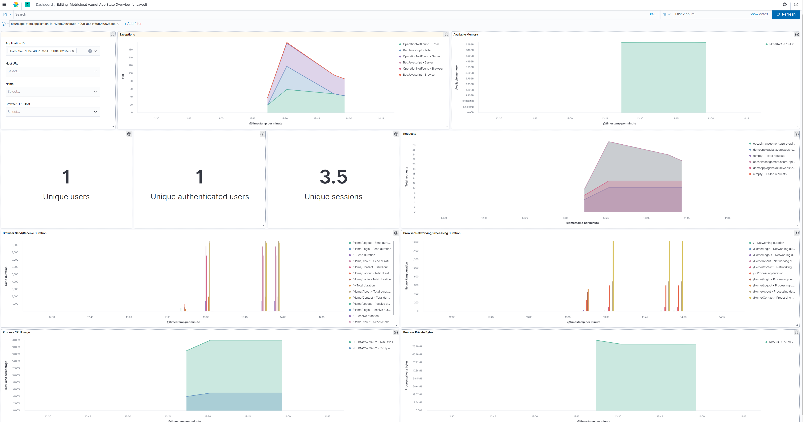

---
mapped_pages:
  - https://www.elastic.co/guide/en/beats/metricbeat/current/metricbeat-module-azure.html
---

<!-- This file is generated! See scripts/docs_collector.py -->

# Azure module [metricbeat-module-azure]

:::::{admonition} Prefer to use {{agent}} for this use case?
Refer to the [Elastic Integrations documentation](integration-docs://reference/azure_metrics/index.md).

::::{dropdown} Learn more
{{agent}} is a single, unified way to add monitoring for logs, metrics, and other types of data to a host. It can also protect hosts from security threats, query data from operating systems, forward data from remote services or hardware, and more. Refer to the documentation for a detailed [comparison of {{beats}} and {{agent}}](docs-content://reference/fleet/index.md).

::::


:::::


The Azure Monitor feature collects and aggregates logs and metrics from a variety of sources into a common data platform where it can be used for analysis, visualization, and alerting.

The azure monitor metrics are numerical values that describe some aspect of a system at a particular point in time. They are collected at regular intervals and are identified with a timestamp, a name, a value, and one or more defining labels.

The azure module will periodically retrieve the azure monitor metrics using the Azure REST APIs as MetricList. Additional azure API calls will be executed in order to retrieve information regarding the resources targeted by the user.

::::{important}
Extra Azure charges on metric queries may be generated by this module. Please see [additional notes about metrics and costs](#azure-api-cost) for more details.
::::


### Dashboards [_dashboards]

The azure module comes with several predefined dashboards for virtual machines, VM guest metrics and virtual machine scale sets.

The VM overview dashboard shows information about CPU, memory, disk usage as well as operations per second. The two available filters help narrowing down the dashbord to specific regions and/or resource groups. For example:



If VM guest metrics are enabled then the guest metrics overview dashboard can help with monitoring ASP.NET applications and SQL Server metrics. For example:


The virtual machine scale sets dashboard is similar to the VM dashboard and shows relevant health information about running vm scale sets. For example:



The Azure storage dashboards show all relevant metrics for the blob, file, table and queue storage services:



The Azure billing dashboards show relevant usage and forecast information:



The Azure app_state dashboard shows relevant application insights information:




### Module-specific configuration notes [_module_specific_configuration_notes_2]

All the tasks executed against the Azure Monitor REST API will use the Azure Resource Manager authentication model. Therefore, all requests must be authenticated with Azure Active Directory (Azure AD). One approach to authenticate the client application is to create an Azure AD service principal and retrieve the authentication (JWT) token. For a more detailed walk-through, have a look at using Azure PowerShell to create a service principal to access resources [https://docs.microsoft.com/en-us/powershell/azure/create-azure-service-principal-azureps?view=azps-2.7.0](https://docs.microsoft.com/en-us/powershell/azure/create-azure-service-principal-azureps?view=azps-2.7.0). It is also possible to create a service principal via the Azure portal [https://docs.microsoft.com/en-us/azure/active-directory/develop/howto-create-service-principal-portal](https://docs.microsoft.com/en-us/azure/active-directory/develop/howto-create-service-principal-portal). Users will have to make sure the roles assigned to the application contain at least reading permissions to the monitor data, more on the roles here [https://docs.microsoft.com/en-us/azure/role-based-access-control/built-in-roles](https://docs.microsoft.com/en-us/azure/role-based-access-control/built-in-roles).

Required credentials for the `azure` module:

`client_id`
:   The unique identifier for the application (also known as Application Id)

`client_secret`
:   The client/application secret/key

`subscription_id`
:   The unique identifier for the azure subscription

`tenant_id`
:   The unique identifier of the Azure Active Directory instance

The azure credentials keys can be used if configured `AZURE_CLIENT_ID`, `AZURE_CLIENT_SECRET`, `AZURE_TENANT_ID`, `AZURE_SUBSCRIPTION_ID`

`resource_manager_endpoint`
:   *string* Optional, by default the azure public environment will be used, to override, users can provide a specific resource manager endpoint in order to use a different azure environment. Ex: [https://management.chinacloudapi.cn](https://management.chinacloudapi.cn) for azure ChinaCloud [https://management.microsoftazure.de](https://management.microsoftazure.de) for azure GermanCloud [https://management.azure.com](https://management.azure.com) for azure PublicCloud [https://management.usgovcloudapi.net](https://management.usgovcloudapi.net) for azure USGovernmentCloud

`active_directory_endpoint`
:   *string* Optional, by default the associated active directory endpoint to the resource manager endpoint will be used, to override, users can provide a specific active directory endpoint in order to use a different azure environment. Ex: [https://login.microsoftonline.com](https://login.microsoftonline.com) for azure ChinaCloud [https://login.microsoftonline.us](https://login.microsoftonline.us) for azure GermanCloud [https://login.chinacloudapi.cn](https://login.chinacloudapi.cn) for azure PublicCloud [https://login.microsoftonline.de](https://login.microsoftonline.de) for azure USGovernmentCloud

`resource_manager_audience`
:   *string* Optional, by default we are using the azure public environment, to override, users can provide a specific resource manager audience in order to use a different azure environment. Ex: [https://management.chinacloudapi.cn/](https://management.chinacloudapi.cn/) for azure ChinaCloud [https://management.microsoftazure.de/](https://management.microsoftazure.de/) for azure GermanCloud [https://management.azure.com/](https://management.azure.com/) for azure PublicCloud [https://management.usgovcloudapi.net/](https://management.usgovcloudapi.net/) for azure USGovernmentCloud Users can also use this in case of a Hybrid Cloud model, where one may define their own audiences.


## Metricsets [_metricsets_10]


### `monitor` [_monitor]

This metricset allows users to retrieve metrics from specified resources. Added filters can apply here as the interval of retrieving these metrics, metric names, aggregation list, namespaces and metric dimensions. The monitor metrics will have a minimum timegrain of 5 minutes, so the `period` for `monitor` metricset should be `300s` or multiples of `300s`.


### `compute_vm` [_compute_vm]

This metricset will collect metrics from the virtual machines, these metrics will have a timegrain every 5 minutes, so the `period` for `compute_vm` metricset  should be `300s` or multiples of `300s`.


### `compute_vm_scaleset` [_compute_vm_scaleset]

This metricset will collect metrics from the virtual machine scalesets, these metrics will have a timegrain every 5 minutes, so the `period` for `compute_vm_scaleset` metricset  should be `300s` or multiples of `300s`.


### `storage` [_storage]

This metricset will collect metrics from the storage accounts, these metrics will have a timegrain every 5 minutes, so the `period` for `storage` metricset  should be `300s` or multiples of `300s`.


### `container_instance` [_container_instance]

This metricset will collect metrics from specified container groups, these metrics will have a timegrain every 5 minutes, so the `period` for `container_instance` metricset  should be `300s` or multiples of `300s`.


### `container_registry` [_container_registry]

This metricset will collect metrics from the container registries, these metrics will have a timegrain every 5 minutes, so the `period` for `container_registry` metricset  should be `300s` or multiples of `300s`.


### `container_service` [_container_service]

This metricset will collect metrics from the container services, these metrics will have a timegrain every 5 minutes, so the `period` for `container_service` metricset  should be `300s` or multiples of `300s`.


### `database_account` [_database_account]

This metricset will collect relevant metrics from specified database accounts, these metrics will have a timegrain every 5 minutes, so the `period` for `database_account` metricset  should be `300s` or multiples of `300s`.


### `billing` [_billing_2]

This metricset will collect relevant usage data and forecast information from a specific subscription, these metrics will have a timegrain every 24 hours, so the `period` for `billing` metricset  should be `24h` or multiples of `24h`.


### `app_insights` [_app_insights]

This metricset will collect application insights metrics, the `period` (interval) for the `app-insights` metricset is set by default at `300s`.


### `app_state` [_app_state]

This metricset concentrate on the most relevant application insights metrics and provides a dashboard for visualization, the `period` (interval) for the `app_state` metricset is set by default at `300s`.


## Additional notes about metrics and costs [azure-api-cost]

Costs: Metric queries are charged based on the number of standard API calls. More information on pricing here [https://azure.microsoft.com/id-id/pricing/details/monitor/](https://azure.microsoft.com/id-id/pricing/details/monitor/).

Authentication: we are handling authentication on our side (creating/renewing the authentication token), so we advise users to use dedicated credentials for metricbeat only.


## Example configuration [_example_configuration]

The Azure module supports the standard configuration options that are described in [Modules](/reference/metricbeat/configuration-metricbeat.md). Here is an example configuration:

```yaml
metricbeat.modules:
- module: azure
  metricsets:
  - monitor
  enabled: true
  period: 300s
  client_id: '${AZURE_CLIENT_ID:""}'
  client_secret: '${AZURE_CLIENT_SECRET:""}'
  tenant_id: '${AZURE_TENANT_ID:""}'
  subscription_id: '${AZURE_SUBSCRIPTION_ID:""}'
  resources:
    - resource_query: "resourceType eq 'Microsoft.DocumentDb/databaseAccounts'"
      metrics:
      - name: ["DataUsage", "DocumentCount", "DocumentQuota"]
        namespace: "Microsoft.DocumentDb/databaseAccounts"

- module: azure
  metricsets:
  - compute_vm
  enabled: true
  period: 300s
  client_id: '${AZURE_CLIENT_ID:""}'
  client_secret: '${AZURE_CLIENT_SECRET:""}'
  tenant_id: '${AZURE_TENANT_ID:""}'
  subscription_id: '${AZURE_SUBSCRIPTION_ID:""}'

- module: azure
  metricsets:
  - compute_vm_scaleset
  enabled: true
  period: 300s
  client_id: '${AZURE_CLIENT_ID:""}'
  client_secret: '${AZURE_CLIENT_SECRET:""}'
  tenant_id: '${AZURE_TENANT_ID:""}'
  subscription_id: '${AZURE_SUBSCRIPTION_ID:""}'

- module: azure
  metricsets:
  - storage
  enabled: true
  period: 300s
  client_id: '${AZURE_CLIENT_ID:""}'
  client_secret: '${AZURE_CLIENT_SECRET:""}'
  tenant_id: '${AZURE_TENANT_ID:""}'
  subscription_id: '${AZURE_SUBSCRIPTION_ID:""}'

- module: azure
  metricsets:
  - container_instance
  enabled: true
  period: 300s
  client_id: '${AZURE_CLIENT_ID:""}'
  client_secret: '${AZURE_CLIENT_SECRET:""}'
  tenant_id: '${AZURE_TENANT_ID:""}'
  subscription_id: '${AZURE_SUBSCRIPTION_ID:""}'

- module: azure
  metricsets:
  - container_service
  enabled: true
  period: 300s
  client_id: '${AZURE_CLIENT_ID:""}'
  client_secret: '${AZURE_CLIENT_SECRET:""}'
  tenant_id: '${AZURE_TENANT_ID:""}'
  subscription_id: '${AZURE_SUBSCRIPTION_ID:""}'

- module: azure
  metricsets:
  - container_registry
  enabled: true
  period: 300s
  client_id: '${AZURE_CLIENT_ID:""}'
  client_secret: '${AZURE_CLIENT_SECRET:""}'
  tenant_id: '${AZURE_TENANT_ID:""}'
  subscription_id: '${AZURE_SUBSCRIPTION_ID:""}'

- module: azure
  metricsets:
  - database_account
  enabled: true
  period: 300s
  client_id: '${AZURE_CLIENT_ID:""}'
  client_secret: '${AZURE_CLIENT_SECRET:""}'
  tenant_id: '${AZURE_TENANT_ID:""}'
  subscription_id: '${AZURE_SUBSCRIPTION_ID:""}'

- module: azure
  metricsets:
    - billing
  enabled: true
  period: 24h
  client_id: '${AZURE_CLIENT_ID:""}'
  client_secret: '${AZURE_CLIENT_SECRET:""}'
  tenant_id: '${AZURE_TENANT_ID:""}'
  subscription_id: '${AZURE_SUBSCRIPTION_ID:""}'

- module: azure
  metricsets:
    - app_insights
  enabled: true
  period: 300s
  application_id: ''
  api_key: ''
  metrics:
    - id: ["requests/count", "requests/duration"]

- module: azure
  metricsets:
    - app_state
  enabled: true
  period: 300s
  application_id: ''
  api_key: ''
```


## Metricsets [_metricsets]

The following metricsets are available:

* [app_insights](/reference/metricbeat/metricbeat-metricset-azure-app_insights.md)
* [app_state](/reference/metricbeat/metricbeat-metricset-azure-app_state.md)
* [billing](/reference/metricbeat/metricbeat-metricset-azure-billing.md)
* [compute_vm](/reference/metricbeat/metricbeat-metricset-azure-compute_vm.md)
* [compute_vm_scaleset](/reference/metricbeat/metricbeat-metricset-azure-compute_vm_scaleset.md)
* [container_instance](/reference/metricbeat/metricbeat-metricset-azure-container_instance.md)
* [container_registry](/reference/metricbeat/metricbeat-metricset-azure-container_registry.md)
* [container_service](/reference/metricbeat/metricbeat-metricset-azure-container_service.md)
* [database_account](/reference/metricbeat/metricbeat-metricset-azure-database_account.md)
* [monitor](/reference/metricbeat/metricbeat-metricset-azure-monitor.md)
* [storage](/reference/metricbeat/metricbeat-metricset-azure-storage.md)
