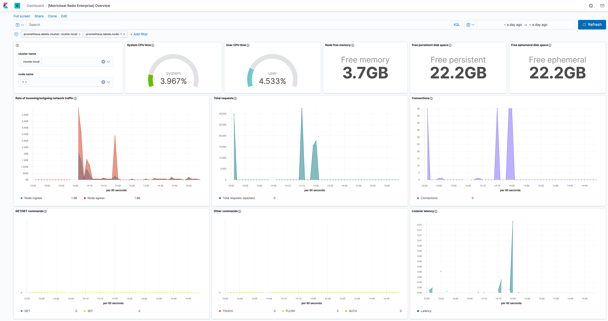

---
mapped_pages:
  - https://www.elastic.co/guide/en/beats/metricbeat/current/metricbeat-module-redisenterprise.html
---

<!-- This file is generated! See scripts/mage/docs_collector.go -->

# Redis Enterprise module [metricbeat-module-redisenterprise]

::::{warning}
This functionality is in beta and is subject to change. The design and code is less mature than official GA features and is being provided as-is with no warranties. Beta features are not subject to the support SLA of official GA features.
::::


This module periodically fetches metrics from [Redis Enterprise Software](https://redislabs.com/redis-enterprise/).

The defaut metricsets are `node` and `proxy`.


## Module-specific configuration notes [_module_specific_configuration_notes_19]

The `redisenterprise` module has these additional config options:

**`hosts`**
:   URLs that are used to connect to Redis. URL format: `https://HOST:PORT`


## Compatibility [_compatibility_46]

The metricsets `node` and `proxy` are compatible with Redis Enterprise Software (RES). There were tested with RES 5.4.10-22 and are expected to work with all versions >= 5.0.2.


## Dashboard [_dashboard_40]

The `redisenterprise` module includes a predefined dashboard with overview information of the monitored servers.




## Example configuration [_example_configuration]

The Redis Enterprise module supports the standard configuration options that are described in [Modules](/reference/metricbeat/configuration-metricbeat.md). Here is an example configuration:

```yaml
metricbeat.modules:
- module: redisenterprise
  metricsets:
    - node
    - proxy
  period: 1m

  # Metrics endpoint
  hosts: ["https://127.0.0.1:8070/"]
```


## Metricsets [_metricsets]

The following metricsets are available:

* [node](/reference/metricbeat/metricbeat-metricset-redisenterprise-node.md)
* [proxy](/reference/metricbeat/metricbeat-metricset-redisenterprise-proxy.md)
